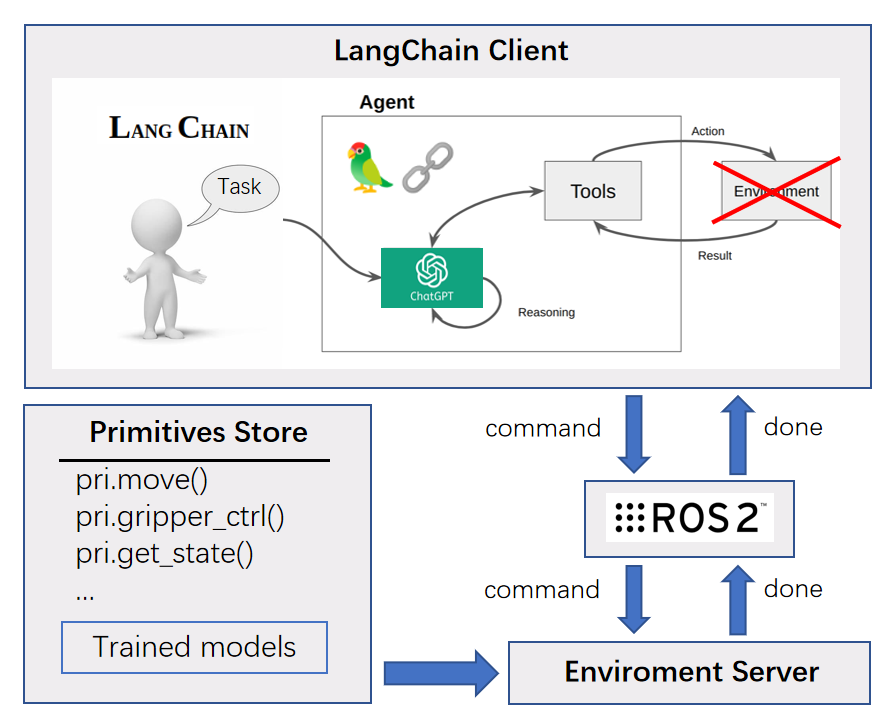
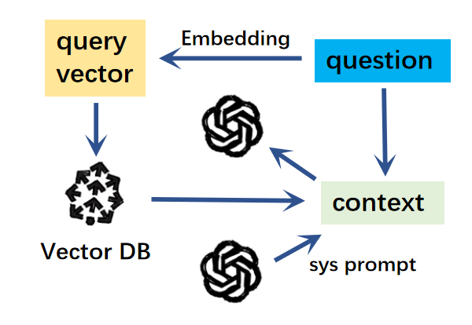

<h1 align="center">欢迎使用 llm_plan_robot 👋</h1>  

--- 
> 结合通讯组件（ROS/TCP）与 Langchain 的仿真框架，通过使用大语言模型，能够使用自然语言对机器人进行控制。  

## 简介

为了使用大语言模型对机器人下达指令，让机器人理解，自行生成任务代码并执行。本项目使用了 Langchain 与 TCP（or ROS），基于提示工程对机器人操作方面的提示词内容进行了设计。
具体地，系统的运行流程为：
1. 初始化 langchain（包括 LLM、chain、tools）、ros/tcp、仿真环境
2. 在客户端内输入一个请求，发送到 chain 内
3. 在 chain 内，使用 tools 对该请求进行文本预处理操作
4. 把处理后的请求发送给大语言模型，获得回答
5. 把回答发送到服务端
6. 在服务端内提取出回答内包含的可执行代码片段，并执行
7. 执行结果作为响应回传到客户端中

针对在线部署和离线部署，分别提供了不同的选择：

|          -           |         online         |                   offline                   |
|:--------------------:|:----------------------:|:-------------------------------------------:|
| Large Language Model |        gpt-3.5         |           QWEN2(from Huggingface)           |
|   Embedding Model    | OpenAI-Embedding-Model |          optional(from Huggingface)         |
|    Vector Store      |        Pinecone        |                   optional                  |

## 部署

**环境准备：**  
>Ubuntu-20.04+ / Windows  
Python 3.8+  
langchain  

**使用 TCP 进行通讯的部署流程：**
0. (建议)新建 conda 环境
    ```
    conda create -n llm_plan_robot python=3.11
    ```
1. 克隆本仓库到本地
    ```
    git clone https://github.com/Gchaojian/llm_plan_robot 
    ```
2. 安装相关依赖

**使用 ROS 进行通讯的部署流程：**
1. 新建 ros 工作空间并进入空间中
   ```commandline
    mkdir gpt_ws && cd gpt_ws
    ```
2. 克隆本仓库到工作空间
    ```
    git clone https://github.com/Gchaojian/llm_plan_robot
   ```
3. 安装相关依赖
    ```
    pip install -r src/requirements.txt
    rosdep install --from-paths src --ignore-src -r -y
   ```
4. 编译，排查报错
    ```
   colcon build --symlink-install
   ```

## 使用

---
### 0. (可选)添加密钥
如果使用在线的大语言模型或向量数据库，如 ChatGPT、Pinecone 等，需要
添加 `gpt_client/gpt_client/commons/config.json` 文件内的密钥
   ```
   "OPENAI_API_KEY": "<Your openai-key>"
   "PINECONE_API_KEY": "<Your pinecone-key>"
   ```
[pinecone](https://www.pinecone.io/) 是一个在线的向量数据库，如果有需要请自行注册

### 2. 运行

**B. 使用 TCP 进行通讯**

直接运行脚本即可，例如 `gpt_client/gpt_client/examples/client_tcp_***.py` .

**A. 使用 ROS2 进行通讯**

分别在两个终端中启动 llm 服务端和 robot 客户端，等待初始化完成后，
我们可以在终端内输入请求或问题，等待服务端执行或回应。
```bash
# Terminal 1
ros2 run gpt_server gpt_server
```
```bash
# Terminal 2
ros2 run gpt_client gpt_client
```

### 3. 提示工程
参考 Microsoft 的 [PromptCraft-Robotics](https://github.com/microsoft/PromptCraft-Robotics)，我们编写了一些用于机器人操作场景的提示词，这些提示词存放在 `gpt_client/prompts` 中，分为四个文本：
1. primitives - 技能原语提示词
2. scene - 任务场景提示词
3. task_settings - 任务要求提示词
4. system - 系统提示词

通过 langchain 提供的 prompt template 将这些文本以及我们的输入文本串联成一个提示词模板，方便大语言模型的理解。



另外，可以使用一些工具对上面的提示词进行处理。例如使用 `memory` 工具将过去的 QA 存放到提示词模板中，让大语言模型能够记忆上下文内容。但是这样会造成 token 的用量越来越多，使模型回应的速度变慢或消耗更多的金钱。

因此，更推荐 `retriever` 工具，即使用向量数据库索引，进行输入文本的相似度匹配，并可以减少冗余提示词造成的影响。



上面两种提到的示例可以在示例代码中切换。

根据这些提示词，LLM 能识别我们的指令，并在服务端中转换成可以被执行的 Python 代码进行执行。我们可以修改或添加提示词，让机器人能够根据自然语言的输入执行相应的任务。

### 问题
## 1. 网络代理报错
在使用OpenAI的接口时，可能会发生如下报错：
`pydantic.v1.error_wrappers.ValidationError: 1 validation error for ChatOpenAI
__root__
  Unknown scheme for proxy URL URL('socks://127.0.0.1:7891/') (type=value_error)`

解决方法：
查看自己的代理设置，并禁用掉以 socks 开头的代理
```bash 
env | grep -i proxy
unset all_proxy
unset ALL_PROXY
``` 
**2. 系统指令**  
在聊天框中输入以下指令，可以执行对应的动作。

| 命令     | 描述   |
|--------|------|
| !exit  | 退出进程 |
| !quit  | 退出进程 |
| !clear | 清屏   |